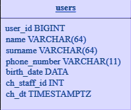
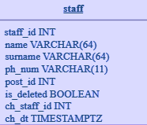

# SCHEMA humanresource




# Примеры использования функций
### Добавление пользователя
```sql
select humanresource.users_upd('{
  "name": "Boris",
  "surname": "Ugolev",
  "phone_number": "+7999999999",
  "birth_day": "2004-01-02"}', 2542);
```
### Изменения данных пользователя
```sql
select humanresource.users_upd('{
  "user_id": 1,
  "name": "Boris",
  "surname": "Ugolev",
  "phone_number": "+7926999999",
  "birth_day": "2004-01-02"}', 2542);
```
#### Результат правильного выполнения
```json
{"data": NULL}
```
### Добавление подписчика
```sql
select humanresource.subcribers_upd('{
  "user_id": 1,
  "type_id": 2
}', 2542);
```
#### Ошибка при введении не существующей подписки
```json
{
  "errors": [
    {
      "error": "dictionary.subscribestypes.type_id",
      "detail": "type_id = 1",
      "message": "Нет такой подписки!"
    }
  ]
}
```